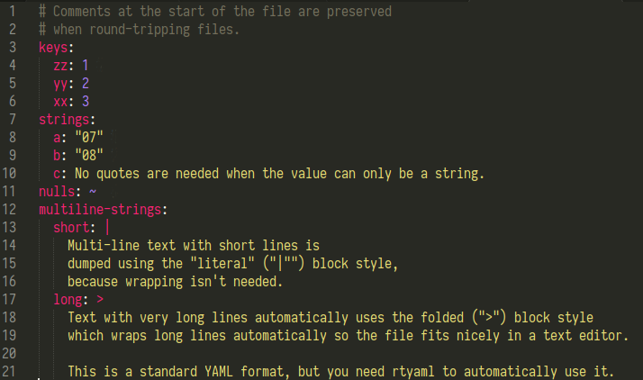
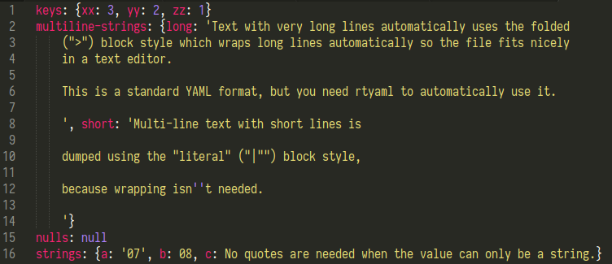

rtyaml: Round-trippable YAML
============================

Primary author: Joshua Tauberer <https://razor.occams.info>

-   GitHub: <https://github.com/unitedstates/rtyaml>
-   PyPi: <https://pypi.python.org/pypi/rtyaml>

This module is a wrapper around `pyyaml` to read and write YAML files with some improvements:

-   Round-tripping YAML files is possible by preserving the order of keys. In Python 3.7+, just use regular `dict`s. In prior versions of Python, use `collections.OrderedDict`.
-   Saner defaults are set for how strings are written out to YAML (see below).
-   Other sane defaults are chosen like using the "safe" loader/dumper.
-   A comment block found at the very beginning of a stream when loading YAML is preserved when writing it back out.

## What do you mean by round-tripping?

Round-tripping is when you load a file and then save it unchanged, you expect the bytes on disk not to change. This isn't possible with PyYAML, and it makes it difficult to use YAML files with version control like git because every time you load and save the file, things can get rearranged. Keys can change order, string quoting styles can change, #-comments are removed, and so on.

Although `rtyaml` can't provide round-tripping for all files, it does set some sane defaults on PyYAML so that it's easier to achieve. For instance, if you load this file with PyYAML:



and then save it back out unchanged:

```python
import yaml
print(yaml.dump(yaml.load(open('example.yaml'))))
```

you get this mess:



Notice how the comment is gone, the keys `zz`, `yy`, `xx` changed order, the strings are inconsistently formatted, nulls use a confusing keyword, and mappings are condensed into single lines.

With `ryaml`, you actually get the original file back! That's basically the whole point of this library.


## Installation and usage

Install:

    pip install rtyaml
    (or pip3 --- this module works in both Python 2 and Python 3)

Usage:

    import rtyaml
    
    with open("myfile.yaml") as f:
      stuff = rtyaml.load(f)
    
    # ...do things to stuf...
    
    with open("myfile.yaml", "w") as f:
      rtyaml.dump(stuff, f)

As in the underlying pyyaml library, `load` accepts a string or bytes-string containing YAML or an open file object (binary or text). Also, the second argument to `dump` is optional and if omitted the function returns the YAML in a string.

`load_all` and `dump_all` are also supported, which load and save lists of documents using YAML's `---` document separator.

Dependencies
------------

-   pyyaml (in Ubuntu, the `python-yaml` or `python3-yaml` package)
-   libyaml (in Ubuntu, the `libyaml-0-2` package plus, at install time only, `libyaml-dev`)

Details
-------

This library does the following:

-   Uses the native libyaml CSafeLoader and CDumper for both speed and trustable operations.
-   Preserves the order of keys in `dicts` rather than alphebetizing the keys (Python >=3.7).
-   Allows you to use `collections.OrderedDict`s with `dump` to preserve key order (useful before Python 3.7).
-   Writes multi-line strings in block mode (rather than quoted with ugly escaped newline characters), choosing between the literal or folded mode depending on what looks better for the length of the lines in the string.
-   Writes mappings and lists in the expanded (one per line) format, which is nice when the output is going in version control.
-   Modifies the flow string quoting rules so that any string made up of digits is serialized with quotes. (The default settings serialize the string "01" with quotes but the string "09" without quotes! (Can you figure out why?))
-   `None` is serialized as the tilde rather than as `null`, which is less confusing.
-   If a block comment appears at the start of the file (i.e. one or more lines starting with a '#'), write it back out if the same object is written with rtyaml.dump().

For Python 3.6 and earlier:

-   Loads mappings `collections.OrderedDict` so that the key order remains the same when dumping the file later using. (This is no longer needed in Python 3.7 because key order is preserved in regular `dict`s now.)

For Python 2.x and earlier:

-   Writes unicode strings without any weird YAML tag. They just appear as strings. Output is UTF-8 encoded, and non-ASCII characters appear as Unicode without escaping.

With-Block Helper for Editing Files In-Place
--------------------------------------------

The `rtyaml.edit` class is a utility class that can be used with with blocks that makes it easier to edit YAML files in-place. For example:

```
with rtyaml.edit("path/to/data.yaml", default={}) as data:  
   data\["hello"\] = "world"
```

The file is opened for editing ("r+" mode, or "w+" mode if it doesn't exist and a default value is given) and its contents is parsed and returned as the data with-block variable. The file is kept open while the with-block is executing. When the with-block exits, the with-block variable is written back to the file as YAML, and then the file is closed.

This will, of course, only work if the file contains an array or object (dict), and you cannot assign a new value to the with-block variable (that's just how Python with blocks work). You can only call its methods, i.e., you can edit the list (append, pop, sort, etc.) and dict (get/set keys), but you can't replace the value with an entirely new list or dict.

If the default parameter is not given, or is None, the file must exist. Otherwise, if the file doesn't exist, it's created and the with-block variable will start you off with the default value.

You can also pass a stream as the first argument if you want to open the file yourself. The stream must support seek, truncate, and close. If you open a file, you should use the "r+" or "w+" mode.

Public domain dedication
------------------------

This project is dedicated to the public domain, as indicated in the LICENSE file:

> The project is in the public domain within the United States, and copyright and related rights in the work worldwide are waived through the CC0 1.0 Universal public domain dedication. <http://creativecommons.org/publicdomain/zero/1.0/>

All contributions to this project must be released under the CC0 dedication. By submitting a pull request, you are agreeing to comply with this waiver of copyright interest.
